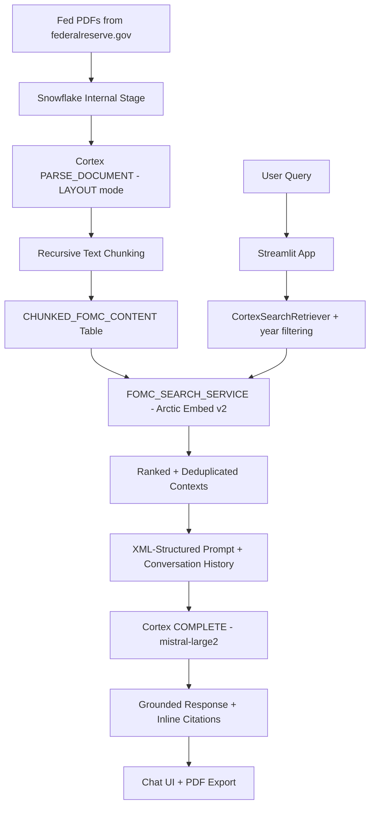

# 📈 Federal Reserve AI Research Assistant

**A production-grade, fully serverless RAG system that turns 10,000+ pages of Federal Reserve documents (2023–2026) into an intelligent economic research co-pilot.**

[](https://federal-reserve-ai-research-assistant.streamlit.app/)

🔗 **Live Demo:** [federal-reserve-ai-research-assistant.streamlit.app](https://federal-reserve-ai-research-assistant.streamlit.app/)

---

## Why This Project Exists

Federal Reserve communications are among the most consequential — and most impenetrable — economic documents in the world. FOMC minutes, press conference transcripts, Beige Books, Projection Tables, and Monetary Policy Reports are scattered across hundreds of PDFs spanning years of policy decisions.

This application eliminates that friction. Ask a plain-English question about monetary policy, inflation, labor markets, financial stability, or historical FOMC decisions and receive grounded, source-cited answers synthesized in real time from the Fed's own primary documents — with every response traceable back to the exact source PDF.

---

## Architecture



---

## Features

- **Semantic search** over ~10,000 pages via Snowflake Cortex Search + `snowflake-arctic-embed-l-v2.0`
- **Year-aware retrieval** — regex extracts temporal scope from the query and filters document results accordingly
- **Conversational memory** — maintains rolling context of the last 2 Q&A turns, with semantic weighting toward follow-up questions
- **Structured prompt engineering** using XML-tagged system prompts with glossary, grounding instructions, and conversation history
- **Dual-model inference** — `mistral-large2` primary, `mixtral-8x7b` fallback, both via `SNOWFLAKE.CORTEX.COMPLETE`
- **Threaded LLM execution** — background thread runs blocking SQL inference while the main thread animates a live progress bar
- **One-click research export** — full session with questions, answers, and cited sources as a timestamped PDF (ReportLab)
- **Source transparency** — every response links to the exact Fed PDF with document type and date parsed from the filename

---

## RAG Pipeline — Technical Details

### 1. Data Ingestion (Jupyter Notebook)
- Federal Reserve PDFs downloaded directly from `federalreserve.gov` and uploaded to a Snowflake internal stage
- Parsed via `SNOWFLAKE.CORTEX.PARSE_DOCUMENT` in `LAYOUT` mode for structure-aware text extraction
- Chunked with `SNOWFLAKE.CORTEX.SPLIT_TEXT_RECURSIVE_CHARACTER` (1,800 token chunks, 250 token overlap)
- Indexed into `FOMC_SEARCH_SERVICE` using the `snowflake-arctic-embed-l-v2.0` embedding model

### 2. Retrieval
- `CortexSearchRetriever` fetches up to 36 candidate chunks (3× the final limit), then deduplicates by source document
- Regex extracts year references from the query; results are filtered to the relevant temporal window
- Final context is sorted by recency and capped at 12 documents

### 3. Prompt Engineering & Generation
- System prompt uses XML tags (`<context>`, `<instructions>`, `<glossary>`, `<conversation_history>`) for reliable instruction following
- Context is grouped by year for chronological coherence and hard-capped at 40,000 characters
- Model is instructed to cite source documents inline (e.g., *"According to the FOMC Minutes from January 2025..."*) and to explicitly flag when reasoning beyond the provided context

### 4. Observability (TruLens)
- Full pipeline instrumented with OpenTelemetry spans via TruLens `@instrument` decorators
- Retrieval and generation traces logged to a dedicated Snowflake observability schema
- Enables systematic evaluation of context relevance, answer faithfulness, and retrieval quality

---

## Document Coverage

| Document Type | Description |
|---|---|
| FOMC Minutes | Detailed records of each Federal Open Market Committee meeting |
| Press Conference Transcripts | Chair Powell's post-meeting Q&A sessions |
| Beige Book | Regional economic condition summaries (8× per year) |
| Monetary Policy Reports | Semi-annual reports to Congress |
| Projection Tables (Dot Plot) | Rate, inflation, and GDP projections by FOMC participants |
| FOMC Longer-Run Goals | The Fed's formal statement on monetary policy framework |
| Financial Stability Reports | Semi-annual assessments of systemic financial risk |

**Coverage: 2023 – 2026**

---

## Tech Stack

| Layer | Technology |
|---|---|
| Frontend | Streamlit (Community Cloud) |
| Vector Search | Snowflake Cortex Search |
| Embeddings | snowflake-arctic-embed-l-v2.0 |
| LLM (primary) | Mistral Large 2 (via Snowflake Cortex) |
| LLM (fallback) | Mixtral 8x7B (via Snowflake Cortex) |
| Python SDK | Snowpark Python, snowflake-ml-python |
| Document Processing | Cortex PARSE_DOCUMENT + SPLIT_TEXT_RECURSIVE_CHARACTER |
| Observability | TruLens + OpenTelemetry |
| PDF Generation | ReportLab |

---

## Design Decisions

**Why Snowflake Cortex instead of a standalone vector DB?**
All data, compute, and LLM inference live within a single Snowflake environment. This eliminates egress costs, simplifies auth, and keeps sensitive financial research within a governed data platform — no external API keys or third-party vector store to manage.

**Why call Cortex Complete via SQL instead of the REST API?**
Snowflake's Cortex REST endpoint has auth friction in certain deployment environments. Executing `SNOWFLAKE.CORTEX.COMPLETE` as a SQL function via Snowpark is simpler, more reliable, and avoids token management entirely.

**Why thread the LLM call?**
Blocking Streamlit on a synchronous SQL call freezes the UI for 10–30 seconds. A background thread runs the inference while the main thread animates a progress bar, keeping the experience responsive without a full async rewrite.

**Why XML-tagged prompts?**
Structured tags give the model unambiguous section boundaries, which measurably improves instruction following on large, multi-section prompts — especially when mixing retrieved context, conversation history, and behavioral instructions in the same call.

---

## Project Structure

```
federal-reserve-ai-research-assistant/
├── app.py                                   # Production Streamlit application
├── BUILD_RAG_WITH_CORTEX_SEARCH.ipynb       # Data pipeline + TruLens evaluation notebook
├── requirements.txt
└── .streamlit/
    └── secrets.toml                         # Snowflake credentials (gitignored)
```

---

## Local Setup

### Prerequisites
- Python 3.10+
- Snowflake account with Cortex features enabled

### Install

```bash
git clone https://github.com/comet000/federal-reserve-ai-research-assistant.git
cd federal-reserve-ai-research-assistant
pip install -r requirements.txt
```

### Configure Secrets

Create `.streamlit/secrets.toml`:

```toml
account   = "your-snowflake-account"
user      = "your-username"
password  = "your-password"
warehouse = "CORTEX_SEARCH_TUTORIAL_WH"
database  = "CORTEX_SEARCH_TUTORIAL_DB"
schema    = "PUBLIC"
role      = "your-role"
```

### Run

```bash
streamlit run app.py
```

Open `BUILD_RAG_WITH_CORTEX_SEARCH.ipynb` in Snowflake Notebooks to build the RAG index from scratch.

---

## Example Questions

> *"What's the median rate projection for next year?"*

> *"To what extent do tariff policy and trade disruptions factor into the Fed's inflation outlook?"*

> *"How did the FOMC assess the labor market in mid-2024?"*

> *"What are the greatest risks to financial stability over the next 12–18 months?"*

> *"When and how fast should the Fed cut rates — if at all?"*

> *"Are supply chain issues still showing up regionally?"*

---

## License

MIT License — free to use, modify, and build upon.
